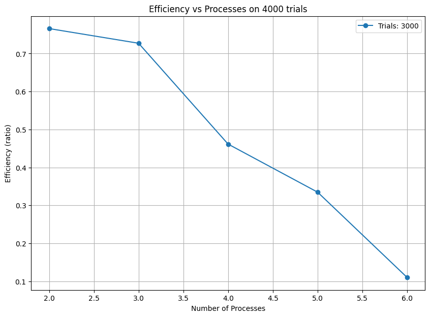
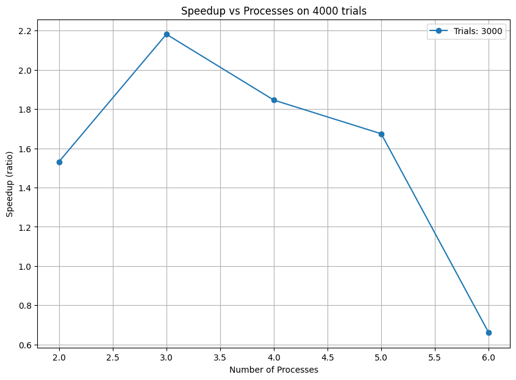
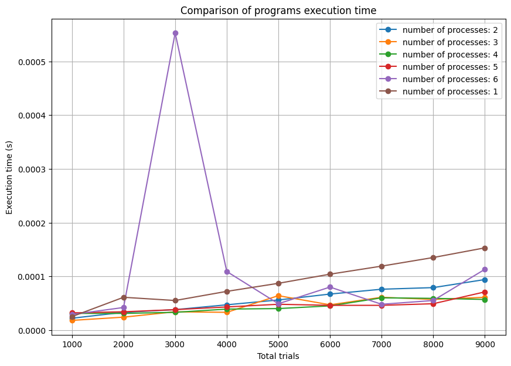
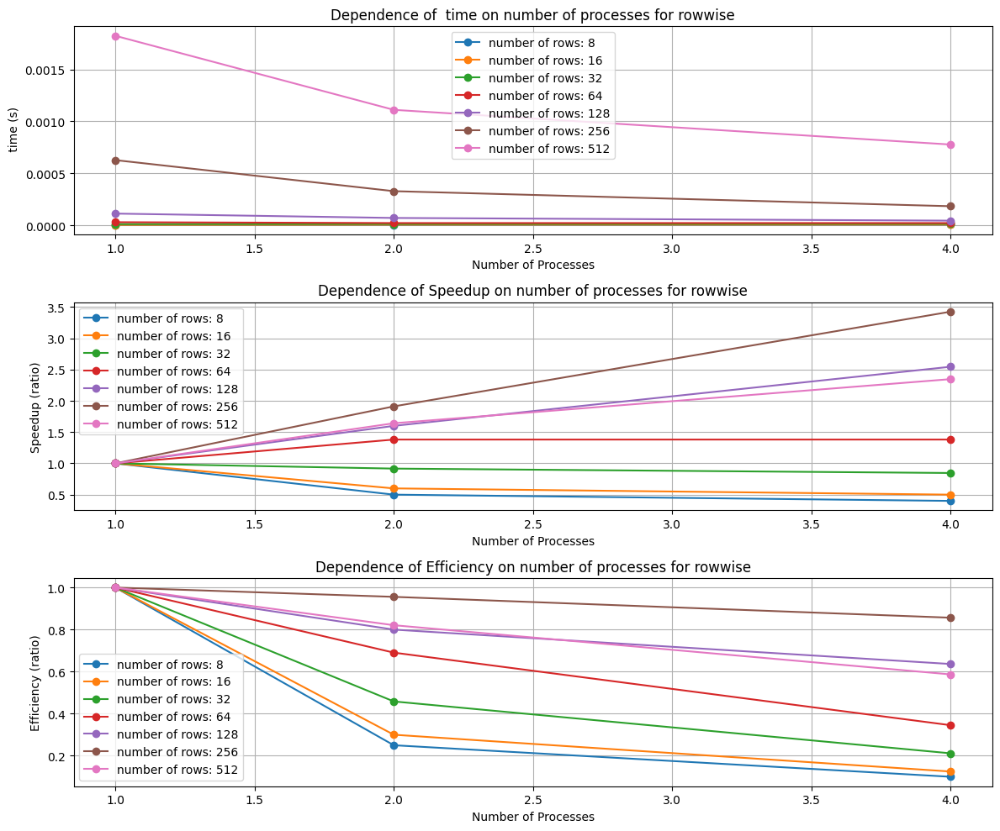
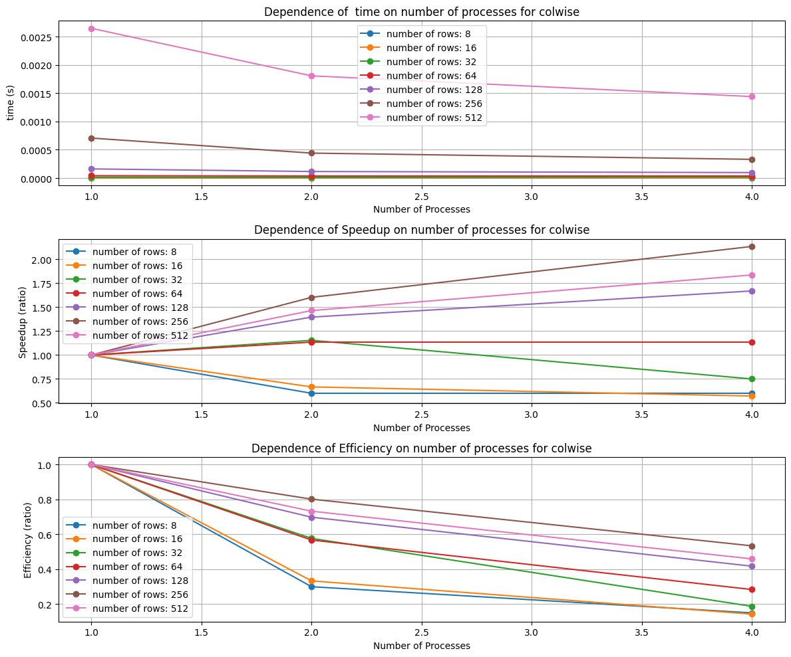
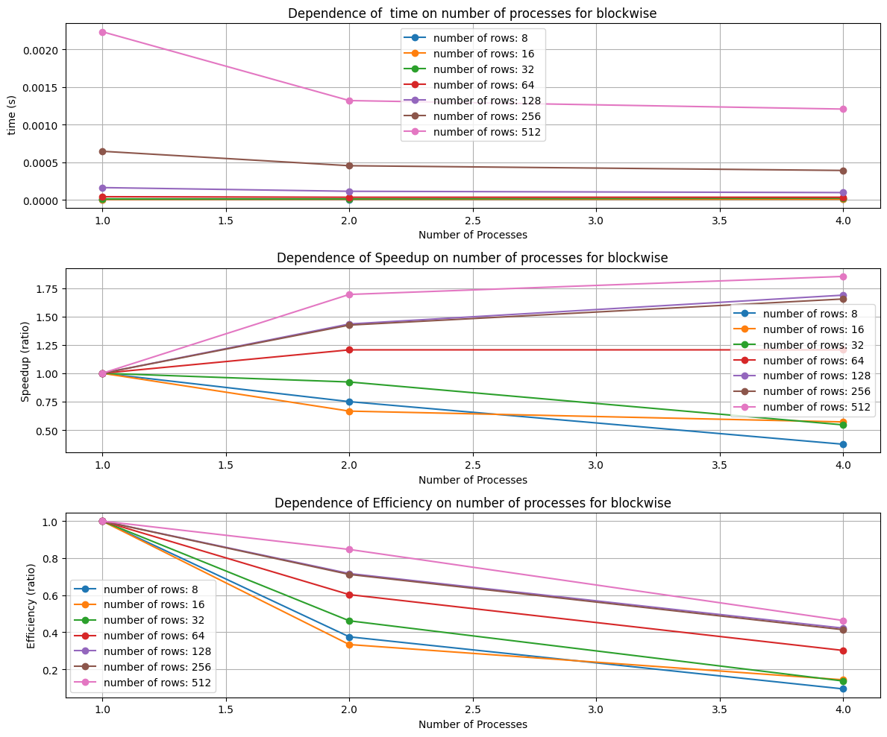
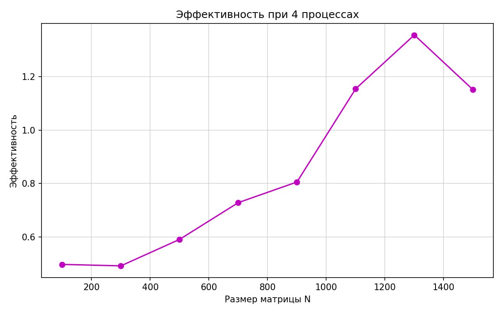
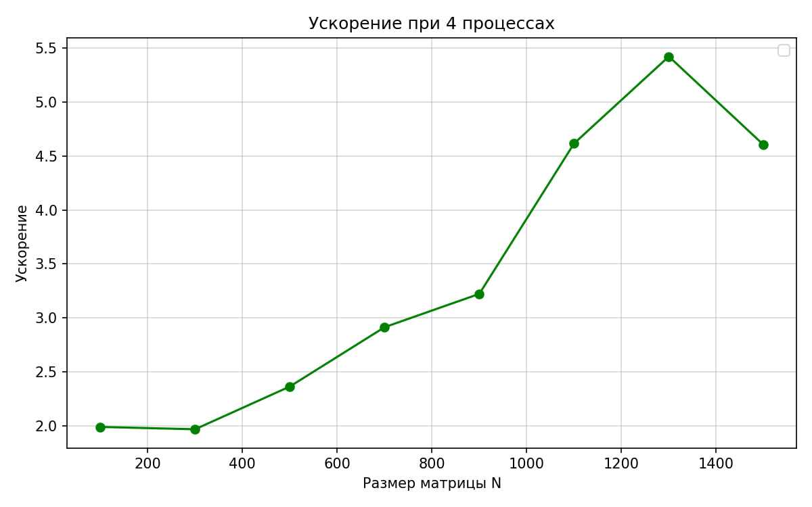
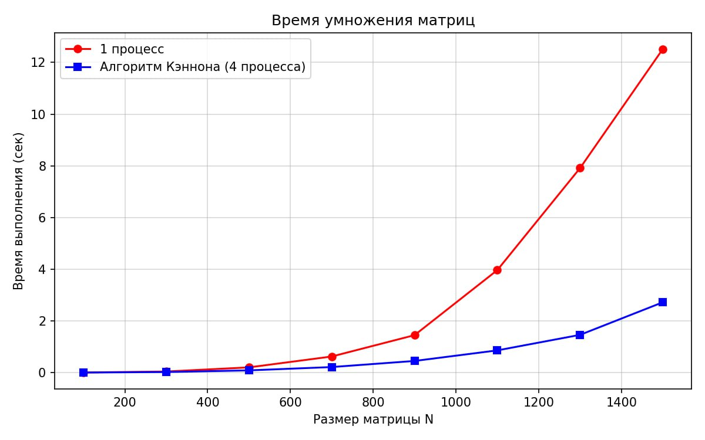

# Лабораторная работа №1 по распределенным вычислениям

**Работу выполнили Спасюк Мария, Стрежнева Вера, Родионцева Ирина, группа 22ПМИ-1**

## Задание 1
Результаты работы программы находятся в task_1/result.csv

**Графики производительности**

**Выводы:**

По графикам можно заметить, что время выполнения (для большого набора данных) сначала уменьшается с ростом количества процессов, а потом после 4-х процессов начинает снова расти. Это можно объяснить тем, что тратится всё больше времени на коммуникацию между процессами.

В эксперименте для 4000 точек есть небольшой участок роста ускорения при росте количества процессов, но потом наблюдается спад, и при 6 процессах ускорение вообще становится меньше 1. Это говорит о том, что программа стала работать медленнее последовательной. Это можно опять же объяснить затратами времени на коммуникацию.

Эффективность уменьшается с ростом количества процессов, так как ускорение тоже постепенно падает, а процессов становится всё больше. Из этого можно сделать вывод, что большое количество процессов не говорит о высокой эффективности программы.

## Задание 2
Результаты работы алгоритмов находятся в task_2/data/out

**Графики производительности**

* Разбиение по строкам

* Разбиение по столбцам

* Разбиение по блокам

**Выводы:**

Поскольку от размеров матрицы зависит количество процессов, мы могли использовать только 1, 2 или 4 процесса. На графике видно, что с ростом количества процессов время выполнения программы на больших матрицах уменьшается. На маленьких матрицах этот тренд наблюдается либо очень слабо, либо в обратную сторону.

Ускорение на больших матрицах растёт, но недостаточно быстро, поэтому эффективность постепенно падает.

Алгоритм для умножения матрицы на вектор, использующий разбиение по строкам, работает быстрее, чем два другие. Можно заметить, что ускорение у него гораздо выше, чем у остальных.

## Задание 3
Результат работы алгоритма для матриц из A.txt и B.txt находится в task_3/output.txt

**Графики производительности**

**Выводы:**

Был реализован алгоритм Кэннона с помощью MPI. На маленьких матрицах выгода от распараллеливания почти незаметна из-за затрат на коммуникацию между процессами. Но по мере увеличения размера матрицы параллельная версия работает всё быстрее по сравнению с последовательной: ускорение более 5 при использовании 4 процессов. Данный алгоритм может быть эффективен для больших задач, где объём вычислений значительно превышает затраты на коммуникацию.
